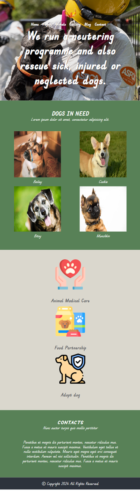

# AnimalRescue

## Description
This project involves making an unresponsive website (HTML + CSS + images) responsive. The site's layout should adjust according to the browser viewport/screen size. Specifically, you need to implement a layout for screens with a width of 600px or less (mobile).

## Requirements
- Write responsive styles only in the `responsive.css` file.
- The site should display correctly in the latest version of Google Chrome.
- Ensure valid HTML5 and CSS3.

## Live Demo
The project can be viewed at the following link:  
[graceful-valkyrie-677e4e.netlify.app](https://graceful-valkyrie-677e4e.netlify.app/)

## Screenshot
